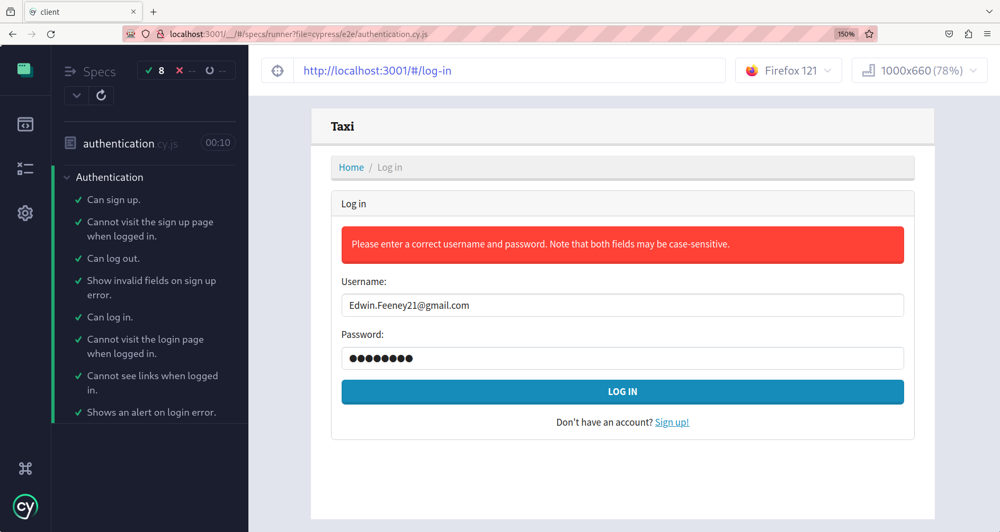
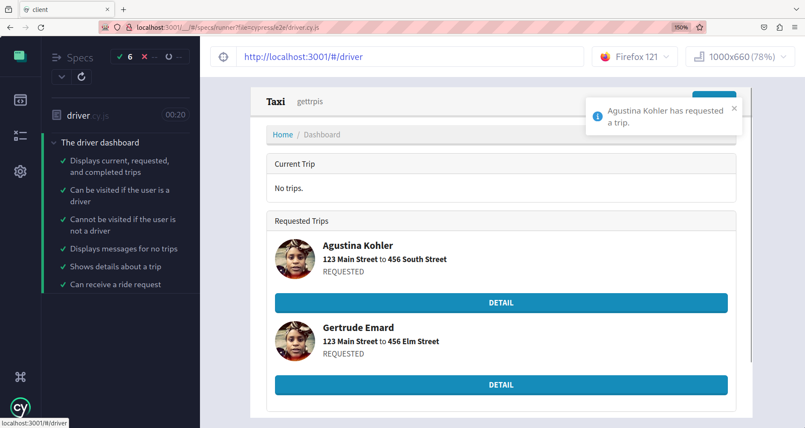
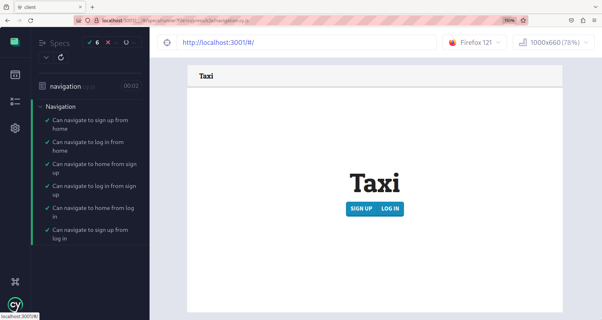
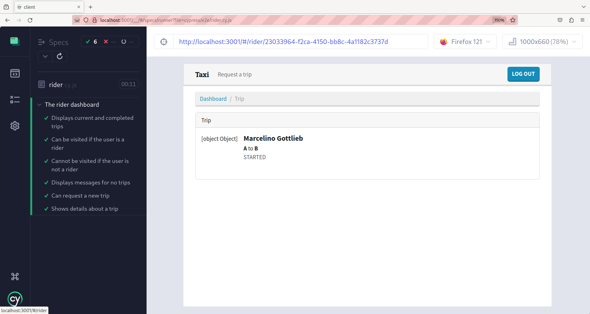
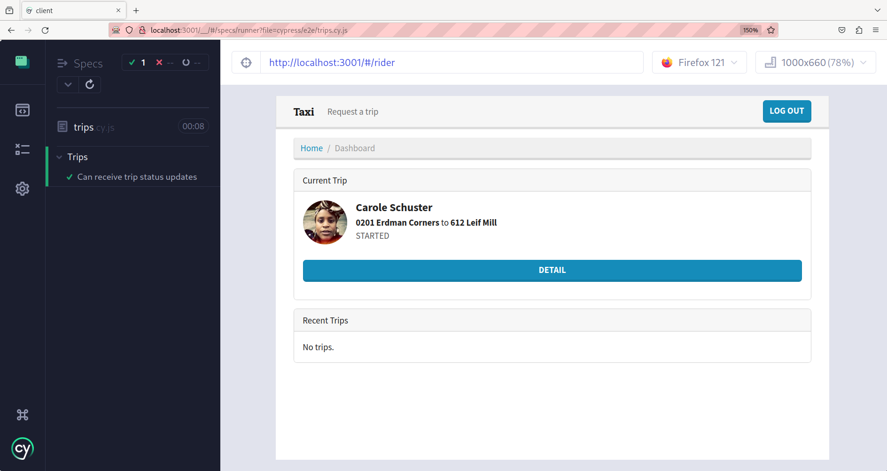

# taxi-app

## Table of Contents

- [Introduction](#Introduction)
- [Testing](#testing)
- [How to Build Taxi App on Your Machine](#how-to-build-taxi-app-on-your-machine)
  - [Clone the Repository](#clone-the-repository)
  - [Build and Run the Backend with Docker](#build-and-run-the-backend-with-docker)
  - [Build and Run the Frontend](#build-and-run-the-frontend)
  - [to run Frontend tests](#to-run-frontend-tests)

## Introduction

This is a taxi app built using Django Rest Framework, PostgreSQL, and Redis. The app allows users to sign up, log in, request trips, and view trip details. There are separate functionalities for riders and drivers.


# important info: when clone this repo go to completed tests branch to see the best version of this code so far

# Testing







## Authentication

- [x] Can sign up.
- [x] Cannot visit the sign-up page when logged in.
- [x] Can log out.
- [x] Show invalid fields on sign-up error.
- [x] Can log in.
- [x] Cannot visit the login page when logged in.
- [x] Cannot see links when logged in.
- [x] Shows an alert on login error.

## Navigation

- [x] Can navigate to sign up from home.
- [x] Can navigate to log in from home.
- [x] Can navigate to home from sign up.
- [x] Can navigate to log in from sign up.
- [x] Can navigate to home from log in.
- [x] Can navigate to sign up from log in.

## Rider Dashboard

- [x] Displays current and completed trips.
- [x] Can be visited if the user is a rider.
- [x] Cannot be visited if the user is not a rider.
- [x] Displays messages for no trips.
- [x] Can request a new trip.
- [x] Shows details about a trip.

## Driver Dashboard

- [x] Displays current, requested, and completed trips.
- [x] Can be visited if the user is a driver.
- [x] Cannot be visited if the user is not a driver.
- [x] Displays messages for no trips.
- [x] Shows details about a trip.
- [x] Can receive a ride request.

## Trip Status Updates

- [x] Can receive trip status updates.

## How to Build Taxi App on Your Machine

Follow these steps to build and run the Taxi App locally on your machine.

### Prerequisites

- [Docker](https://www.docker.com/) installed
- [docker-compose](https://docs.docker.com/compose/) installed
- [pnpm](https://pnpm.js.org/) installed (for frontend testing)

### Clone the Repository

```bash
git clone <https://github.com/shakori999/taxi-app.git>
cd taxi-app
```
### Build and Run the Backend with Docker

```bash
docker-compose up --build -d
docker-compose exec taxi-app python manage.py makemigrations
docker-compose exec taxi-app python manage.py migrate
```
### Build and Run the Frontend
```bash
cd client
pnpm installe 
```

### to run Frontend tests
```bash
npx cypress open
```


